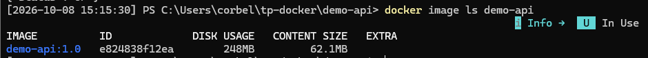
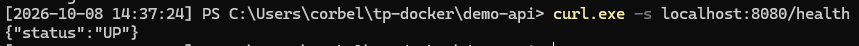
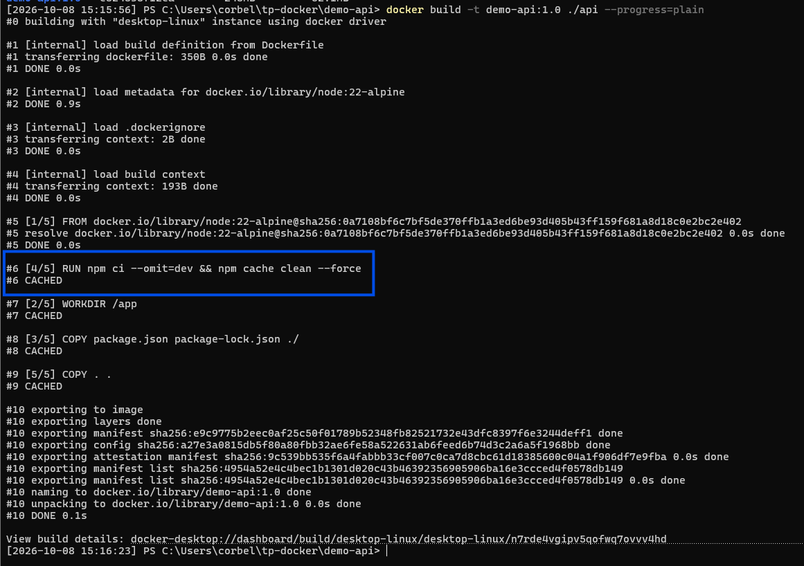
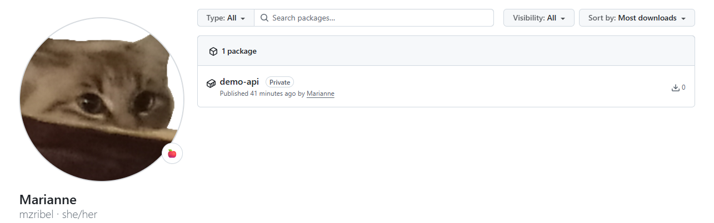

# Quête 2

## Livrables

### Résultat de `docker image ls`

### Résultat du `curl` sur `/health`

### Mise en cache de `npm ci`

### Image publiée sur GHCR
Lien vers l'image : [https://github.com/users/mzribel/packages/container/package/demo-api](https://github.com/users/mzribel/packages/container/package/demo-api)

